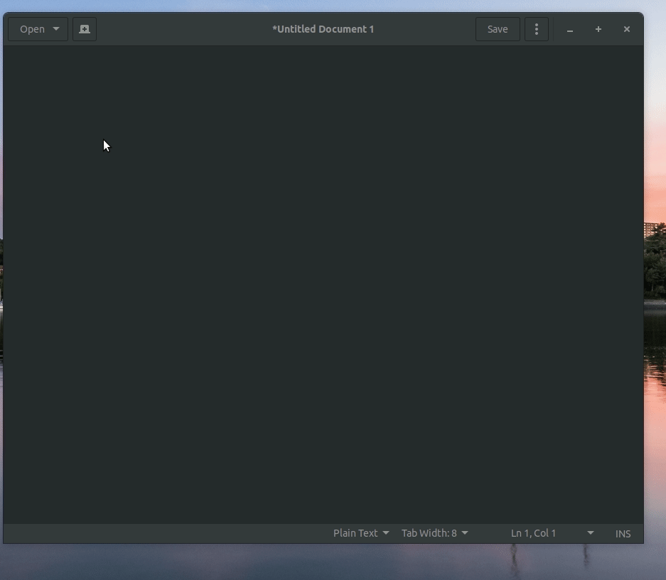

# electron-emojier - a text-to-emoji electron app

## About
electron-emojier makes it simple to paste emojis into your favorite apps.

## Usage
To bring up the text area press `CTRL+Shift+J` then start typing in emojis in this format `:pizza:`, You do not have to copy anything -- electron copies the output to your clipboard automatically. Simply paste into your favorite apps. 

## Example
`I :heart: :pizza:!`
> I ❤️ 🍕

